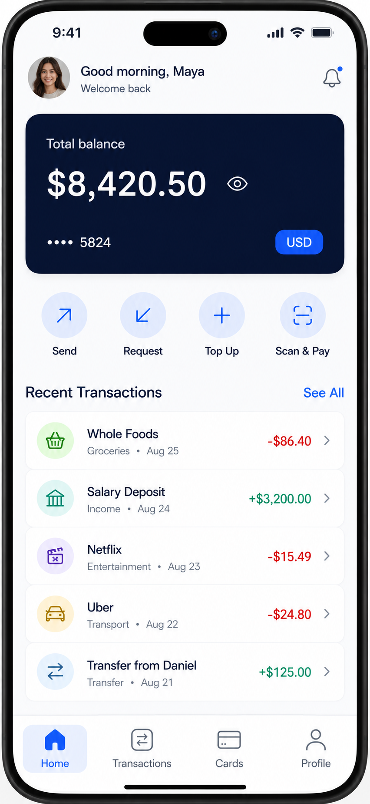
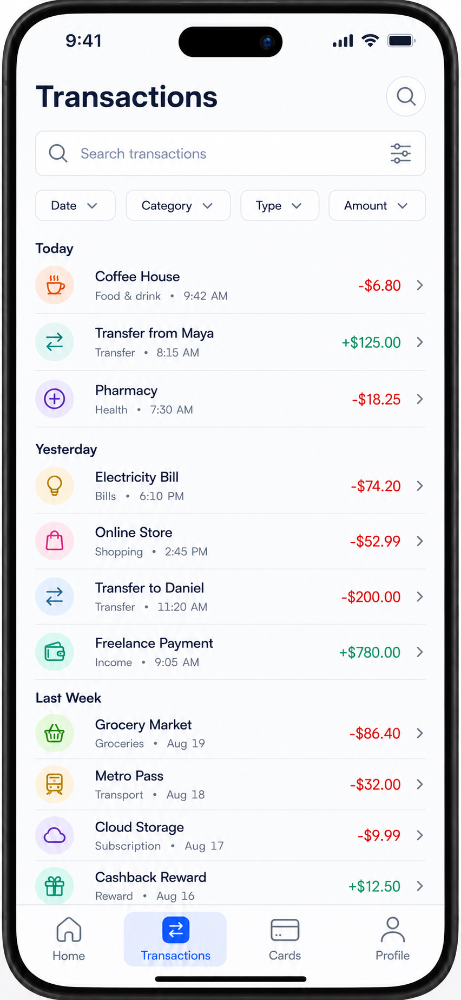
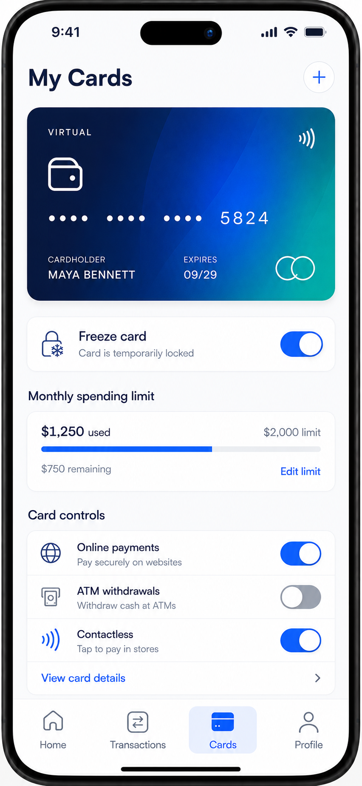
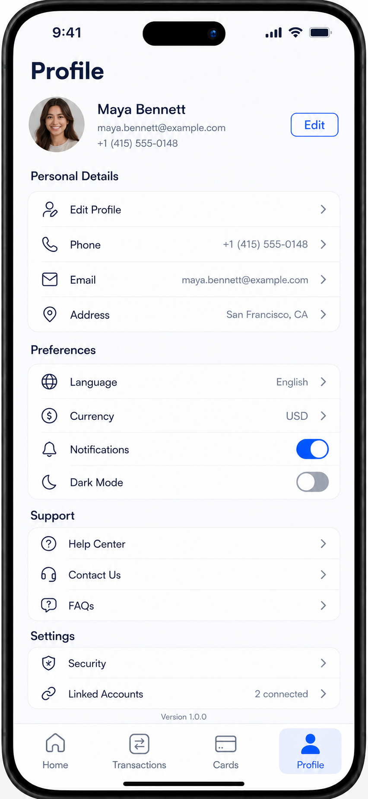

# Digital Wallet

> A polished cross-platform mobile wallet experience built with Expo and React Native.

Digital Wallet presents a clean, modern interface for checking balances, reviewing transactions, managing a virtual card, and updating account preferences. The application recreates a complete four-tab wallet design with responsive layouts, native-safe spacing, interactive controls, and smooth animation.

## Highlights

- At-a-glance balance and recent account activity
- Send, request, top-up, and scan-to-pay shortcuts
- Searchable, categorized transaction history
- Interactive virtual card with a tap-to-flip reverse side
- Card freezing, spending limits, and payment controls
- Personal details, preferences, support, and security settings
- Responsive layouts for iOS, Android, and web
- Typed file-based navigation with Expo Router

## Design Preview

<table>
  <tr>
    <td align='center' width='50%'>
      <strong>Home</strong><br />
      <sub>Balance, quick actions, and recent activity</sub><br /><br />
      
    </td>
    <td align='center' width='50%'>
      <strong>Transactions</strong><br />
      <sub>Search, filters, and grouped history</sub><br /><br />
      
    </td>
  </tr>
  <tr>
    <td align='center' width='50%'>
      <strong>Cards</strong><br />
      <sub>Virtual card, limits, and card controls</sub><br /><br />
      
    </td>
    <td align='center' width='50%'>
      <strong>Profile</strong><br />
      <sub>Account details, preferences, and security</sub><br /><br />
      
    </td>
  </tr>
</table>

## Screen Tour

### Home

The Home tab gives Maya an immediate overview of her wallet. It includes the available balance, masked card number, currency, four common wallet actions, notification access, and a color-coded list of recent incoming and outgoing transactions.

### Transactions

The Transactions tab groups activity into Today, Yesterday, and Last Week. It includes transaction search, date/category/type/amount filters, visual categories, timestamps, and clear positive or negative amount styling.

### Cards

The Cards tab provides a virtual payment card and its controls. Tap the card to run a smooth 3D flip and reveal the reverse side with the cardholder name, magnetic stripe, and CVV. The screen also includes card freezing, monthly spending progress, online-payment permissions, ATM access, contactless payments, and card details.

### Profile

The Profile tab organizes personal details, language and currency preferences, notification and dark-mode switches, support resources, security settings, linked accounts, and application version information.

## Technology

| Area | Technology |
| --- | --- |
| Application framework | Expo SDK 54 |
| UI runtime | React Native 0.81 and React 19 |
| Navigation | Expo Router 6 and React Navigation |
| Animation | React Native Reanimated 4 |
| Icons | Expo Vector Icons |
| Language | TypeScript |
| Platforms | Android, iOS, and web |

## Getting Started

### Prerequisites

- Node.js 20.19 or newer
- npm
- Expo Go, an Android emulator, or an iOS simulator for mobile testing

### Installation

1. Open a terminal and enter the project directory.

   ```bash
   cd digital-wallet
   ```

2. Install dependencies.

   ```bash
   npm install
   ```

3. Start the Expo development server.

   ```bash
   npm start
   ```

4. Use the terminal shortcuts to open the desired platform:

   - `a` — Android
   - `i` — iOS
   - `w` — Web

## Available Scripts

| Command | Purpose |
| --- | --- |
| `npm start` | Start the Expo development server |
| `npm run android` | Start Expo and open Android |
| `npm run ios` | Start Expo and open iOS |
| `npm run web` | Start the web application |
| `npm run lint` | Run the Expo ESLint configuration |
| `npx tsc --noEmit` | Run TypeScript validation |

## Project Structure

```text
digital-wallet/
├── app/
│   ├── (tabs)/
│   │   ├── _layout.tsx       # Bottom-tab navigation
│   │   ├── index.tsx         # Home
│   │   ├── transactions.tsx  # Transaction history
│   │   ├── cards.tsx         # Virtual card and controls
│   │   └── profile.tsx       # Account and preferences
│   └── _layout.tsx           # Root application layout
├── components/
│   └── wallet-ui.tsx         # Shared wallet UI primitives
├── design/                   # Original screen references
├── assets/                   # Application images and icons
└── package.json
```

## Design Principles

The interface uses a restrained navy-and-cobalt palette, soft category colors, rounded surfaces, clear financial state indicators, and consistent spacing across every tab. Components remain scrollable on compact screens while retaining the proportions of the supplied reference designs on the target device class.

---

Built with Expo, React Native, and TypeScript.
